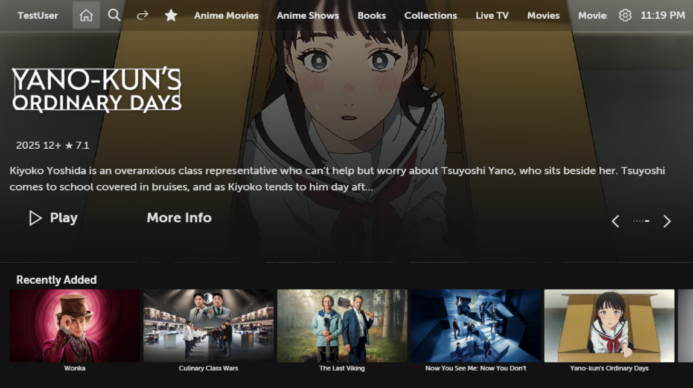
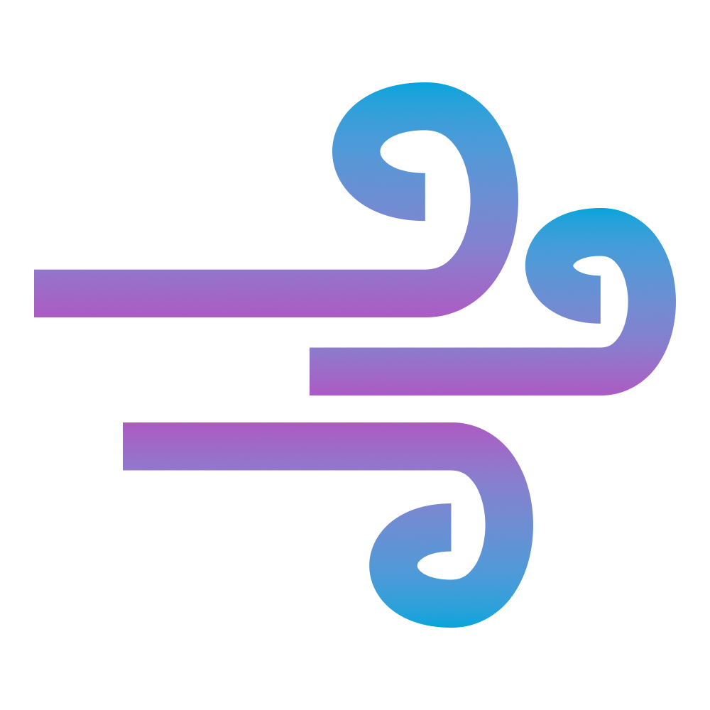

<p align="center">

</p>


<h1>
  
  Breezyfin for webOS
</h1>

Breezyfin is a Jellyfin client for LG webOS TVs, built with Enact Sandstone.
It focuses on TV-first navigation (best suited for usage with the Magic Remote), themeable UI, and resilient playback handling for webOS constraints.

The app was inspired by other great apps and themes, like JellySee, AndroidTV-FireTV, Moonfin, ElegantFin and more. Check them out.

In case of an issue, please report it on GitHub in as much detail as possible.

## Current capabilities

> [!NOTE]
> The app has undergone major refactoring efforts, so please do report any issues if you encounter any.
>
> [Read more in the v0.1.5 announcement](https://github.com/botagas/Breezyfin/discussions/6)

- Multi-server, multi-user saved sessions with quick account switching
- Session restore on startup, with automatic redirect to Login when token/session is expired
- Home, Library, Search, Favorites, Media Details, and Player panels
- Elegant (default) and Classic navigation themes
- Performance Mode and Performance+ Mode (animation reduction options)
- Rich Media Details workflows (favorites, watched status, track pickers, episodes/seasons, side list toggle)
- Player with dynamic-range-aware direct play/direct stream/transcode fallback paths (DV -> HDR -> SDR)
- Subtitle/audio compatibility fallbacks for webOS playback paths, with optional subtitle burn-in policy
- Diagnostics tools (logs, performance overlay, cache wipe, style debug panel)
- Modular Jellyfin service architecture (session/library/item-state/playback domain split)

## Install on TV (IPK)

Watch repository releases for prebuilt IPK artifacts.

1. Download the latest IPK from Releases.
2. Install it with webOS Dev Manager (or your preferred webOS install tool).

## Install on TV (Homebrew dev repo)

Breezyfin is not yet listed in the main Homebrew catalog, but you can add the dev feed now.

1. Open Homebrew Channel on your TV.
2. Go to Repositories / Manage Repositories.
3. Add this repo URL:
`https://raw.githubusercontent.com/botagas/Breezyfin/develop/homebrew-dev.json`
4. Refresh repositories.
5. Install `Breezyfin` from the newly added source.

## Local development

Clone the repository and install dependencies:

```sh
git clone https://github.com/botagas/Breezyfin.git
cd Breezyfin
npm install
```

Start the development server:

```sh
npm run serve
```
Visit [http://localhost:8080](http://localhost:8080) in your browser.

## Developer guidelines

Start with these principles:
- Reuse existing hooks/components before adding new abstractions.
- Keep panel logic modular by using panel-local `components/`, `hooks/`, and `utils/`.
- Keep large behavior flows in dedicated panel hooks (e.g. player load/skip/seek/commands, media details focus/actions).
- Keep `jellyfinService` as a thin facade; place domain logic in `src/services/jellyfin/*`.
- Keep styling token-driven and consistent across themes.
- Reuse shared status badge primitives for watched/favorite/count states instead of panel-specific badge variants.
- For webOS 6 / legacy compat, prefer concrete dimensions in compat files when implicit sizing causes unstable layout.
- Keep comments minimal; document only non-obvious constraints/tradeoffs.

For the full development guide (shared building blocks, panel patterns, style references, and conventions), see:
- [`DEVELOPING.md`](./DEVELOPING.md)
- [`HELPERS.md`](./HELPERS.md)
- [`THEMES.md`](./THEMES.md)
- [`COMPONENTS.md`](./COMPONENTS.md)
- [`VIEWS.md`](./VIEWS.md)
- [`TODOS.md`](./TODOS.md)

## Debug flags

The app supports build-time/runtime debug behavior through environment flags:

Defaults:

- In non-production builds, Style Debug features are enabled by default.
- Persistent app logging follows the same default as Style Debug.
- In production builds, both are off unless explicitly enabled by flags.

Flags:

- `REACT_APP_ENABLE_STYLE_DEBUG=1`
  - Forces Styling Debug panel/features on.
- `REACT_APP_DISABLE_STYLE_DEBUG=1`
  - Forces Styling Debug panel/features off.
- `REACT_APP_ENABLE_PERSISTENT_LOGS=1`
  - Forces persistent app log capture on (stored in `localStorage`).
- `REACT_APP_DISABLE_PERSISTENT_LOGS=1`
  - Forces persistent app log capture off.

Examples:

```sh
# Development server with persistent logs enabled
REACT_APP_ENABLE_PERSISTENT_LOGS=1 npm run serve

# Production build with Style Debug enabled and persistent logs on
REACT_APP_ENABLE_STYLE_DEBUG=1 REACT_APP_ENABLE_PERSISTENT_LOGS=1 npm run pack-p
```

Media Details focus tracing (runtime toggle):

- Query param: `?bfFocusDebug=1`
- Or from browser console:

```js
localStorage.setItem('breezyfinFocusDebug', '1');
```

## Runtime diagnostics (Settings panel)

Diagnostics currently include:

- Performance Overlay (`FPS`, `Input`, `Mode`)
- Playback toast with active dynamic range / play method (for quick validation)
- Unified toast styling/behavior across Player, Media Details, and Settings feedback
- Device playback capability summary in Settings (DV/HDR/codec/audio support snapshot + probe source/timestamp)
- Configurable capability probe refresh period (default 30 days) plus manual "Refresh now" action
- Relaxed Playback Profile toggle (debug-only visibility)
- Styling Debug Panel shortcut (debug-only visibility)
- Logs viewer and clear action
- Wipe App Cache (clears local/session storage, cache storage, IndexedDB, unregisters service workers, then reloads)

## Production build

```sh
npm run pack-p
```
Output will be in the `dist/` folder.

## Code quality audits

- Dead CSS module audit: `npm run audit:styles`
- Mixed JS/LESS duplicate snippet audit: `npm run audit:duplicates`

## Possible improvements

- Stabilize playback across edge-case media by improving server capability checks and fallback messaging.
- Expand hardware / software compatibility by testing across multiple webOS versions and TV chipsets.
- Continue reducing remote-input latency and focus jitter in dense UI views.
- Improve consistency of themed components and shared style tokens across all panels.
- Expand diagnostics with actionable playback telemetry export for issue reports.
- Add automated test coverage for panel navigation, playback recovery paths, and settings persistence.
- Add CI quality gates for lint/test/build plus release artifact checks.
- Improve accessibility/readability options (larger text mode, stronger contrast presets, clearer focus indicators).

See [`TODOS.md`](./TODOS.md) for the prioritized implementation backlog.

## Release automation

This repository supports automated prerelease/stable publishing for webOS Homebrew distribution:

- `develop` branch -> prerelease assets under tag `nightly`
- `main` branch -> stable release under tag `v<appinfo.json version>`

See `docs/homebrew-release-flow.md` for the full branch/release/version workflow.

## Contributing

Pull requests and issues are welcome! Please follow the code style and add tests for new features. See [`COMPONENTS.md`](./COMPONENTS.md) and [`VIEWS.md`](./VIEWS.md) for architecture and UI conventions.

## Credits

- Built with [Enact Sandstone](https://github.com/enactjs/sandstone)
- Uses [Jellyfin SDK](https://github.com/jellyfin/sdk)
- AI-assisted development was used; please review changes carefully and report regressions/issues.
