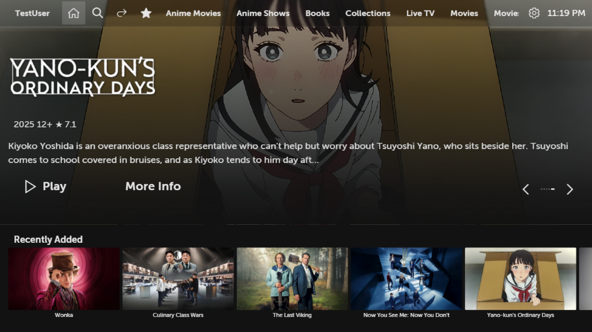

<p align="center">

</p>


<h1>
  
  Breezyfin for webOS
</h1>

Breezyfin is a Jellyfin client for LG webOS TVs, built with Enact Sandstone.
It focuses on TV-first navigation (best suited for usage with the Magic Remote), themeable UI, and resilient playback handling for webOS constraints.

The app was inspired by other great apps and themes, like JellySee, AndroidTV-FireTV, Moonfin, ElegantFin and more. Check them out.

In case of an issue, please report it on GitHub in as much detail as possible.

## Current capabilities

> [!NOTE]
> The app has undergone major refactoring efforts. If you upgrade from an older build, run **Wipe Cache and Reload (Keep Login)** once, and report issues you encounter.

- Multi-server, multi-user saved sessions with quick account switching
- Session restore on startup, with automatic redirect to Login when token/session is expired
- TV-first navigation tuned for LG Magic Remote (5-way and pointer flows)
- Elegant (default) and Classic navigation themes
- Performance Mode and Performance+ Mode (animation reduction options)
- Playback that adapts to TV/media compatibility (Direct Play / Direct Stream / Transcode, DV -> HDR -> SDR)
- Subtitle and audio handling that prioritizes quality while applying compatibility fallbacks when needed
- Adaptive image loading (WebP when supported, with automatic fallback on load failure)
- Built-in diagnostics, logs, and cache tools for easier troubleshooting

## Install on TV (IPK)

Watch repository releases for prebuilt IPK artifacts.

1. Download the latest IPK from Releases.
2. Install it with webOS Dev Manager (or your preferred webOS install tool).

## Install on TV via Homebrew Channel

Breezyfin is listed in the main Homebrew catalog. You can install it from the official catalog.

You may also install the app using the `develop` branch:
1. Open Homebrew Channel on your TV.
2. Go to Repositories / Manage Repositories.
3. Add this repo URL:
`https://raw.githubusercontent.com/botagas/Breezyfin/develop/homebrew-dev.json`
4. Refresh repositories.
5. Install `Breezyfin` from the newly added source.

Beware, `develop` may include breaking changes.

## Local development

Clone the repository and install dependencies:

```sh
git clone https://github.com/botagas/Breezyfin.git
cd Breezyfin
npm install
```

Start the development server:

```sh
npm run serve
```
Visit [http://localhost:8080](http://localhost:8080) in your browser.

## Developer docs

For implementation and workflow details, use:

- [`DEVELOPING.md`](./DEVELOPING.md) for architecture conventions, decomposition rules, shared hooks/utilities, and style patterns
- [`HELPERS.md`](./HELPERS.md), [`THEMES.md`](./THEMES.md), [`COMPONENTS.md`](./COMPONENTS.md), [`VIEWS.md`](./VIEWS.md) for focused references
- [`CHECKS.md`](./CHECKS.md) for recurring validation and pre-release verification
- [`TODOS.md`](./TODOS.md) for prioritized planned work

## Diagnostics and debug

Primary diagnostics are runtime toggles under **Settings > Diagnostics** (including the **Device Playback Capabilities** section).
This includes the performance overlay, extended player debug overlay, focus debug overlay, playback compatibility diagnostics (for example Force DV and fMP4-HLS preference toggles), logs, and cache wipe actions.

Build-time log capture flags:

- `REACT_APP_ENABLE_PERSISTENT_LOGS=1` to force persistent app logs on
- `REACT_APP_DISABLE_PERSISTENT_LOGS=1` to force persistent app logs off

```sh
# Development server with persistent logs enabled
REACT_APP_ENABLE_PERSISTENT_LOGS=1 npm run serve
```

## Production build

```sh
npm run pack-p
```
Output will be in the `dist/` folder.

## Roadmap and validation

Planned work is tracked in [`TODOS.md`](./TODOS.md).
Recurring validation and release checks are tracked in [`CHECKS.md`](./CHECKS.md).

## Release automation

This repository supports automated prerelease/stable publishing for webOS Homebrew distribution:

- `develop` branch -> prerelease assets under tag `nightly`
- `main` branch -> stable release under tag `v<appinfo.json version>`

See `docs/homebrew-release-flow.md` for the full branch/release/version workflow.

## Contributing

Pull requests and issues are welcome! Please follow the code style and add tests for new features. See [`COMPONENTS.md`](./COMPONENTS.md) and [`VIEWS.md`](./VIEWS.md) for architecture and UI conventions.

## Credits

- Built with [Enact Sandstone](https://github.com/enactjs/sandstone)
- Uses [Jellyfin SDK](https://github.com/jellyfin/sdk)

## Disclaimer
- A large set of the latest code is written with AI-assistance. That includes the web interface and underlying systems. While I have learnt and had experience with Python, and have some basic knowledge in HTML/CSS, I am far from being highly proficient. As my time is very limited, I'm often finding myself guiding the AI to do various tasks, verifying and testing the changes, and trying to prevent it from conquering the world. As such, please be aware of the state of the code and feel free to point out areas of improvement.
