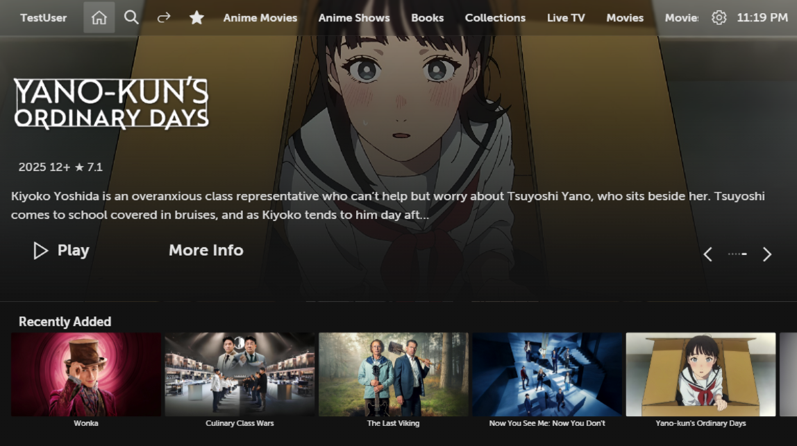

<p align="center">

</p>

<p align="center">
  <a href="https://github.com/botagas/Breezyfin/stargazers"></a>
  <a href="https://github.com/botagas/Breezyfin/releases"></a>
  <a href="./LICENSE"></a>
  <a href="https://github.com/botagas/Breezyfin/releases/latest"></a>
  <a href="https://github.com/botagas/Breezyfin/blob/develop/package.json"></a>
</p>


<h1>
  
  Breezyfin for webOS
</h1>

Breezyfin is a Jellyfin client for LG webOS TVs, built with Enact Sandstone.
It focuses on TV-first navigation (best suited for usage with the Magic Remote), themeable UI, and resilient playback handling for webOS constraints.

The app was inspired by other great apps and themes, like JellySee, AndroidTV-FireTV, Moonfin, ElegantFin and more. Check them out.

In case of an issue, please report it on GitHub in as much detail as possible.

## Current capabilities

> [!NOTE]
> If you face difficulties after major updates, it is advised to run **Wipe Cache and Reload (Keep Login)** once and then report the issues if they persist.

- Multi-server, multi-user saved sessions with quick account switching
- Session restore on startup, with automatic redirect to Login when token/session is expired
- TV-first navigation tuned for LG Magic Remote (5-way and pointer flows)
- Elegant (default) and Classic navigation themes
- Performance Mode and Performance+ Mode (animation reduction options)
- Configurable inactivity screensaver for authenticated browsing views
- Playback that adapts to TV/media compatibility (Direct Play / Direct Stream / Transcode, DV -> HDR -> SDR)
- Smart subtitle and audio handling, including configurable client-rendered text and experimental bitmap subtitles where possible to preserve video quality
- Adaptive image loading (WebP when supported, with automatic fallback on load failure)
- Optional Breezyfin plugin Home sections with built-in Home fallback
- Native Jellyfin Likes Watchlist with optional plugin-backed progress, history, and statistics
- HSS-controlled Discovery feeds and a Calendar view when advertised by the Breezyfin plugin
- App-coordinated native Jellyfin SyncPlay and authenticated JellyWatchParty rooms
- Built-in diagnostics, logs, and cache tools for easier troubleshooting

## Install on TV (IPK)

Watch repository releases for prebuilt IPK artifacts.

1. Download the latest IPK from Releases.
2. Install it with webOS Dev Manager (or your preferred webOS install tool).

## Install on TV via Homebrew Channel

Breezyfin is listed in the main Homebrew catalog. You can install it from the official catalog.

You may also install the app using the `develop` branch:
1. Open Homebrew Channel on your TV.
2. Go to Repositories / Manage Repositories.
3. Add this repo URL:
`https://raw.githubusercontent.com/botagas/Breezyfin/develop/homebrew-dev.json`
4. Refresh repositories.
5. Install `Breezyfin` from the newly added source.

Beware, `develop` may include breaking changes.

## Screenshots


> [!NOTE]
> Images shown in Breezyfin are sourced from a sample media library and are used solely to demonstrate the application’s functionality and user interface. Breezyfin and the Jellyfin project are not affiliated with, sponsored by, or endorsed by the owners, creators, distributors, or other rights holders of the featured media. All trademarks, artwork, images, and other featured content remain the property of their respective rights holders. Their inclusion does not imply any association with or endorsement of Breezyfin or the Jellyfin project.

## Local development

Clone the repository and install dependencies:

```sh
git clone https://github.com/botagas/Breezyfin.git
cd Breezyfin
npm install
```

Start the development server:

```sh
npm run serve
```
Visit [http://localhost:8080](http://localhost:8080) in your browser.

## Developer docs

For implementation and workflow details, use:

- [`DEVELOPING.md`](./DEVELOPING.md) for architecture conventions, decomposition rules, shared hooks/utilities, and style patterns
- [`QUALITY.md`](./QUALITY.md) for lint/test/audit coverage and external tooling evaluation notes
- [`WORKAROUNDS.md`](./WORKAROUNDS.md) for active upstream/runtime workarounds, their validation, and removal conditions
- [`HELPERS.md`](./HELPERS.md), [`THEMES.md`](./THEMES.md), [`COMPONENTS.md`](./COMPONENTS.md), [`VIEWS.md`](./VIEWS.md) for focused references
- [`CHECKS.md`](./CHECKS.md) for recurring validation and pre-release verification
- [`TODOS.md`](./TODOS.md) for prioritized planned work

## Diagnostics and debug

Optional diagnostics are controlled by **Settings > Diagnostics > Enable Diagnostics** and default off in every release channel. Debug options retain their saved values but stay inactive while diagnostics are disabled. Logs remain accessible so critical or previously captured entries can still be reviewed and cleared.

Build-time log capture flags:

- `REACT_APP_ENABLE_PERSISTENT_LOGS=1` includes persistent-log capability; it does not enable runtime diagnostics
- `REACT_APP_DISABLE_PERSISTENT_LOGS=1` removes all persistent logging, including critical records

```sh
# Development server with logging capability; enable Diagnostics in Settings to capture normal logs
REACT_APP_ENABLE_PERSISTENT_LOGS=1 npm run serve
```

## Production build

```sh
npm run pack-p
```
Output will be in the `dist/` folder.

Production packages include Breezyfin's `LICENSE` and generated
`THIRD_PARTY_NOTICES.txt`. The Git tag matching a published release is the
corresponding source reference for that package.

## Roadmap and validation

Planned work is tracked in [`TODOS.md`](./TODOS.md).
Recurring validation and release checks are tracked in [`CHECKS.md`](./CHECKS.md).

## Release automation

This repository supports automated prerelease/stable publishing for webOS Homebrew distribution:

- `develop` branch -> prerelease assets under tag `nightly`
- `main` branch -> stable release under tag `v<appinfo.json version>`

See `docs/homebrew-release-flow.md` for the full branch/release/version workflow.

## Contributing

Pull requests and issues are welcome! Please follow the code style and add tests for new features. See [`COMPONENTS.md`](./COMPONENTS.md) and [`VIEWS.md`](./VIEWS.md) for architecture and UI conventions.

## License

Breezyfin is licensed under [`GPL-3.0-only`](./LICENSE). Third-party components
and packaged assets remain under their respective licenses, listed in
[`THIRD_PARTY_NOTICES.txt`](./THIRD_PARTY_NOTICES.txt).

## Credits

- Built with [Enact Sandstone](https://github.com/enactjs/sandstone)
- Uses [Jellyfin SDK](https://github.com/jellyfin/sdk)

## Disclaimer
- A large set of the latest code is written with AI-assistance. The initial project was mostly drafted by me, but over time, both the scope and the complexity grew too much for me to handle on my free time. That includes the web interface and underlying systems. While I have learnt and had experience with Python, and have some basic knowledge in HTML/CSS, I am far from being highly proficient. As my time is very limited, I'm often finding myself guiding the AI to do various tasks, verifying and testing the changes, and trying to prevent it from conquering the world. As such, please be aware of the state of the code and feel free to point out areas of improvement. This is for the most part a personal project aimed towards providing a performant Jellyfin client for webOS.

## FAQ

<details>
<summary>
<b>Do you plan to release the client on other platforms besides webOS?</b>
</summary>

No. As of now, webOS has too many quirks that will not be applicable to other platforms. I have a TV that I can test the app with extensively, and as such, it will remain a webOS exclusive.
</details>

<details>
<summary>
<b>Is the app vibecoded?</b>
</summary>
I would say the current state of it is. While the initial versions where mostly me speeding up the workflow, my current circumstances lack the time and mental capacity to do manual labor on the app.
My current workflow consists of making sure the app is not monolithic so I could edit and track changes more easily. I've established strict guidelines for myself and anyone else (including agents) that may interact with the repository, because I know how I want the app to work, what the structure should be, and what kind of code and design decisions should be made (if possible) within webOS constraints. This is my first and only webOS project. Based on the amount of experience I've gained while working on this I can tell that webOS has many situations that need to be accounted for. Sometimes, it is a tad bit too much and I am glad I focus only on webOS releases in this project without broadening the scope.
</details>

<details>
<summary>
<b>How long do you continue developing the app? Won't you just abandon and forget it?</b>
</summary>
Considering I mostly use LG TVs, I will continue supporting it as long as I keep using it. Regardless if AI is used or not, the most important part when developing an application is to make something that you will find a use for, and this is exactly that.
</details>

<details>
<summary>
<b>Have you even tested your app yourself? Seems broken on my TV.</b>
</summary>
Before each release, the app is tested regarding each change using webOS Simulator. After that succeeds and works as intended, it is then tested using the same determined checks on a TV. After that proves to be stable, a release is pushed to the dev branch. Once dev branch proves to be stable for some time while testing on my own TV as well as other testers, it is then pushed to stable for release. There are some exceptions.

If you encounter issues, please report them in the Issues section in as much detail as possible.
</details>
